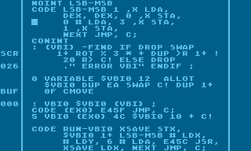
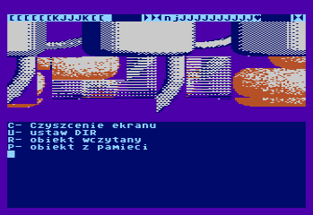
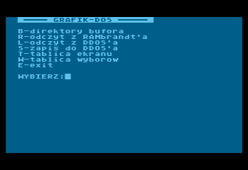
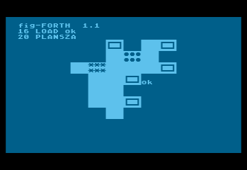

# GAM FORTH and other fig-FORTH sources by Roland Pantoła

This repository features Roland Pantoła's fig-FORTH work for the Atari 800XL, including a modification of the language ("GAM FORTH") and other custom development tools.

With the generous offering from Mr. Pantoła to the [Polish Society for Preserving the Technical Heritage (🇵🇱)](https://ptodt.org.pl/about/), these sources are published here with his approval.

You can find more information about Roland here:
* [Wikipedia entry (🇵🇱)](https://pl.wikipedia.org/wiki/Roland_Panto%C5%82a)
* [Moby Games entry (🇪🇳)](https://www.mobygames.com/person/483332/roland-panto%C5%82a/)

You can find more information about Forth here:
* [The Evolution of Forth (🇪🇳)](https://www.forth.com/resources/forth-programming-language/)
* [Forth: The programming language that writes itself (🇪🇳)](https://ratfactor.com/forth/the_programming_language_that_writes_itself.html)
* [Wikipedia: Forth (programming language) (🇪🇳)](https://en.wikipedia.org/wiki/Forth_(programming_language))

The original 5.25" floppy disks were digitized by Trub.

Review, source selection and this README by BartGo.

## Repository Contents

The following table lists the digitized floppy disk images and their accompanying source files:

| # | Files                 | Name and Description                                 | Download                               |
|---|-----------------------|------------------------------------------------------|----------------------------------------|
| 01 | `img/09_A_Forth.*`    | **FORTH+EDITOR 1.6 / COM** - GAM FORTH (1/2)         | [⚙️](img/09_A_Forth.ATR) [📝](img/09_A_Forth.TXT) |
| 02 | `img/09_B_Ekrany.*`   | **FORTH+EDITOR 1.6 / EKRANY** - GAM FORTH (2/2)      | [🎞️](img/09_B_Ekrany.ATR) [📝](img/09_B_Ekrany.TXT) |
| 03 | `img/11_A_Graf.*`     | **GRAF / COM** - resource manager and editor (1/2)   | [⚙️](img/11_A_Graf.ATR) [📝](img/11_A_Graf.TXT) |
| 04 | `img/11_B_Graf.*`     | **GRAF / EKRANY** - resource manager and editor (2/2) | [🎞️](img/11_B_Graf.ATR) [📝](img/11_B_Graf.TXT) |
| 05 | `img/42_A_GrafDos.*`  | **GRAF-DOS 2.05 / RAMB-KASETA** - resource conversion (1/2) | [⚙️](img/42_A_GrafDos.ATR) [📝](img/42_A_GrafDos.TXT) |
| 06 | `img/42_B_GrafDos.*`  | **GRAF-DOS 2.05 / RAMB-KASETA** - resource conversion (2/2) | [🎞️](img/42_B_GrafDos.ATR) [📝](img/42_B_GrafDos.TXT) |
| 07 | `img/01_A_IronNappy.*`| **IRON NAPPY** - an early game concept (1/1)         | [🎞️](img/01_A_IronNappy.ATR) [📝](img/01_A_IronNappy.TXT) |

All floppy images are in the ATR format and are usually accompanied by LOG files.
 
The above emojis mean:
* ⚙️ - a bootable ATR image with compiled code
* 🎞️ - a non-bootable ATR image with Forth "screens" (source code)
* 📝 - sources from "screens" converted into the TXT format (omitting special ATASCII characters and binary data)
* 🖨️ - sources from "screens" converted into the PDF format (preserving special ATASCII characters and binary data)

**Note on Forth "Screens":** "Screens" are a Forth-specific method for storing source code on floppy disks, serving as an alternative to traditional files. While these sources are converted to TXT format for convenience, the original "screen" concept is preserved by also providing the sources within the ATR floppy images, maintaining their original structure.

## What are these applications?

EDYTOR-FORTH (source editor for Forth "screens"):

This program is already known from the Polish magazine "Tajemnice Atari" ("Atari Secrets") and was described there in 1992-93 Forth course.

GRAF (resource manager), here in one if its submodules:

GRAFIK-DOS (graphics conversion and storage routines):

IRON NAPPY (board generator for an abandoned game concept):

## Dependencies and related Copyright information

This project's sources primarily depend on the public domain "fig-FORTH" model and on its Assembler, created by [Bill Ragsdale](https://github.com/BillRagsdale). However, a specific implementation of the model has been used - [APX Extended fig-FORTH](https://www.atarimania.com/utility-atari-400-800-xl-xe-extended-fig-forth_29927.html), originally distributed by Atari. Today you can obtain APX Forth from [Atari Archives](https://www.atariarchives.org/APX/showinfo.php?cat=20029) (APX20029.DCM is the recommended file). While it is free to download and use, it is important to note that this Forth is **not public domain**.

The closest public domain alternative is "SPACE Forth" by the same author, Patrick L. Mullarky, available from ABBUC as [0220 - Fig-Forth V1.1](https://abbuc.de/download/abbuc_pd_005_0201-0250/#). Porting many elements of this environment to "SPACE Forth" (and potentially other Atari fig-FORTH implementations like Team Atari Forth) should be feasible and might be documented in future.

## Applications and Games Developed with These Tools

Three commercially succesful 8-bit games were developed using these tools: 
  * "A.D. 2044" (1991, 🇵🇱) - see the gameplay on [A.D. 2044 - Atari XL/XE by gregok1973 (🇵🇱)](https://www.youtube.com/watch?v=BUFI9YIeCvc). 
  * "Klątwa"/"The Curse" (1992, 🇵🇱/🇪🇳) - see the gameplay on [Klątwa for the Atari 8-bit family by Highretrogamelord (🇵🇱)](https://www.youtube.com/watch?v=ygqf9H5aB2k).
  * "Władcy Ciemności" (1993, 🇵🇱) - see the gameplay on [Władcy Ciemności - RetRozrywka GamePlay by RetRozrywka (🇵🇱)](https://www.youtube.com/watch?v=yMG_Y_y1VSs).

These games are copyrighted by [LK Avalon](https://www.lkavalon.com/); reeditions may be available at [Retronics](https://retronics.eu/). Related sources are NOT available here.

"Klątwa" and "Władcy Ciemności" were also ported to Commodore 64.

